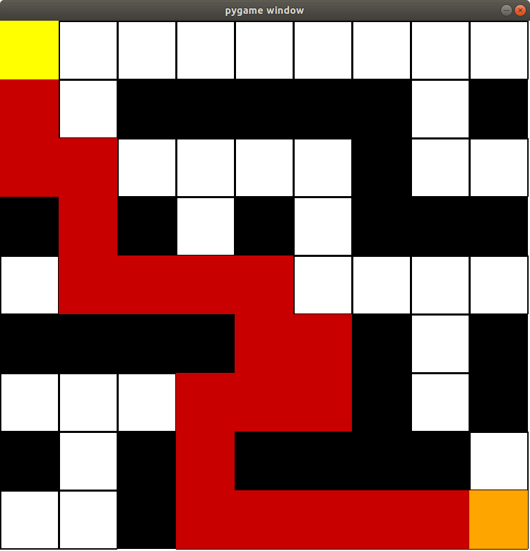

# Repeated-Forward-A*

Repated forward A* used on a small maze.  Going from the upper left to the lower right.

presentation.py is the file used to see the forward A*, backward A*, and
adaptive A* paths

the mazes used for testing are in the mazes folder and named sidewinder0.txt
through sidewinder49.txt

run with "python presentation.py small_mazes/smallwinder0.txt"
you can replace the last argument with a different maze
such as "python presentation.py mazes/sidewinder0.txt"

p resets all paths

f for forward A* path
r steps through all forward A* paths created
g for optimized forward A* path

b for backward A* path
v steps through all backward A* paths created
n for optimized backward A* path

a for adaptive A* path
q steps through all adaptive A* paths
s for optimized A* path
